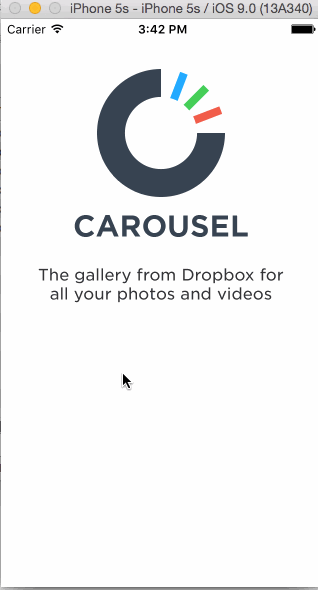

# carousel-w2

This is an iOS demo appliction to leverage views, view properties, and events to create a high fidelity prototype that is difficult to distinguish from a production app.

Time spent: 9 hours spent in total

Completed user stories:

 Required: Sign In
 Optional: The scrollview should only be scrollable when the keyboard is shown
 Optional: Scrolling down a specific amount should:
 Required: Tutorial Screens
 Required: Image Timeline
 Required: Conversations
 Required: Settings
 Optional: Tapping the Sign Out button presents a UIAlertController that gives options to Sign Out or Cancel

 
 